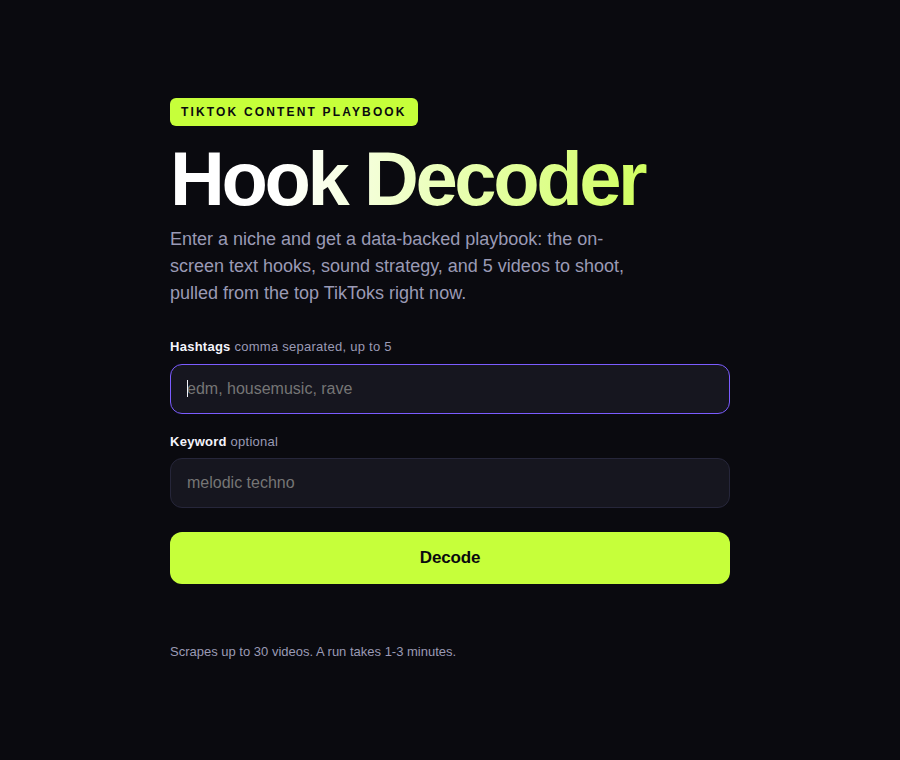

# Tik Tok Analyzer for Creators and Artists

**Point it at a music niche and get a data-backed content playbook: the on-screen text hooks, sound strategy, and 5 videos to shoot, pulled from the top TikToks right now.**

Built for music artists whose videos are them performing or dancing over their own
tracks with text on screen. In this product a **hook** is the **on-screen text
overlay** that stops the scroll, not spoken words, so transcripts are never used.

### Live sample report

[View the sample report](demo/sample-report.html) - a full playbook generated from 30 top TikToks across `#edm`, `#housemusic`, and `#rave`.

## How it works

1. **Apify TikTok scrape** - the `clockworks/tiktok-scraper` actor pulls the top videos for the chosen hashtags (and optional keyword), with all video/transcript download add-ons off.
2. **On-screen hook extraction** - native TikTok sticker text where present, then **Claude vision OCR** (`claude-sonnet-4-6`) reads the burned-in text off every cover image, which catches CapCut-style overlays that never appear in metadata.
3. **Claude analysis** - one synthesis pass names the recurring hook patterns, classifies original vs trending audio (and whether that split shifts with performance), and writes 5 ready-to-shoot ideas mapped back to the data.
4. **Report** - everything renders into a single self-contained dark-theme HTML report, served by the app or saved as a static file.

Videos are ranked by a blended score on engagement **rates** (likes, comments,
shares, saves per play), not raw views, so one mega-viral outlier cannot drown the
patterns.

## Screenshots



The finished report includes a scoreboard, top 5 performers, the hook taxonomy
(the centerpiece), a sound-strategy split, visual/caption/posting findings, and
the 5 content ideas. See [`demo/sample-report.html`](demo/sample-report.html).

## Setup

```bash
npm install
cp .env.example .env      # then add your keys (see below)
npm start                 # http://localhost:3000
```

Open `http://localhost:3000`, enter a niche (hashtags comma separated, plus an
optional keyword), and hit **Decode**. The app scrapes, reads the hooks, runs the
analysis, and shows a loading page until the report is ready (a run takes 1-3
minutes). If the same hashtag set was decoded within the last hour, the existing
report is served instantly instead of re-scraping.

### Keys

Both keys are read only on the server (from `.env`) and never appear in any
client-facing HTML or JavaScript.

```
ANTHROPIC_API_KEY=sk-ant-...     # cover OCR + synthesis (claude-sonnet-4-6)
APIFY_TOKEN=apify_api_...        # from https://console.apify.com/settings/integrations
PORT=3000
```

## Routes

| Route | Purpose |
|-------|---------|
| `GET /` | Landing page (hashtags input, optional keyword, Decode) |
| `POST /generate` | Sanitizes input, serves cache if fresh, else starts a job and returns a `jobId` |
| `GET /loading/:jobId` | Loading page that polls status and redirects to the report when done |
| `GET /status/:jobId` | JSON job status (step, progress, reportUrl or error) |
| `GET /report/:slug` | Serves the finished self-contained report |

Input is sanitized server-side: `#` is stripped, at most 5 hashtags, at most 30
videos per run.

## Project layout

```
server.js            Express server (landing, job runner, status, report serving)
src/pipeline.js      generateReport(hashtags, keywords) - the full pipeline
src/scrape.js        Apify REST scrape (CLI)
src/enrich.js        cover-image OCR + engagement metrics
src/stats.js         deterministic sound / hashtag / posting stats
src/synthesize.js    one Claude synthesis pass -> analysis JSON
src/report.js        renders the self-contained HTML report
demo/sample-report.html   pre-generated EDM playbook for judges
```

## License

MIT - see [LICENSE](LICENSE).
